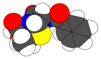
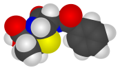
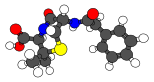
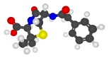
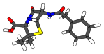
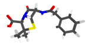
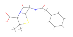
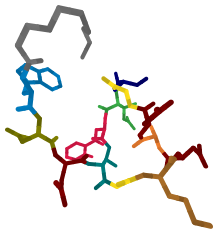
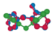
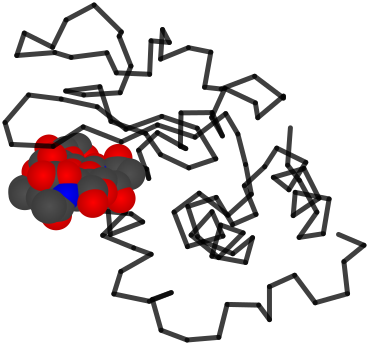

[](./LICENSE)
[](https://github.com/davidmeijer)
[](https://shields.io/)
[](https://chemrxiv.org/engage/chemrxiv/article-details/65bbb3c966c1381729bd6e27)

# CineMol


CineMol is a direct-to-SVG small molecule drawer. 

You can try out CineMol online [here](https://moltools.bioinformatics.nl/cinemol).

## Installation

You can install CineMol with pip from the root of this repository:

```bash
pip install .
```

## Usage CLI

```bash
cinemol -i path/to/your/molecule.sdf -o path/to/your/molecule.svg -s tube -l glossy -r 100 -sc 10.0 --hs
```

Command line options:

* `-i`: input file path to SDF file (str).
* `-o`: output file path to SVG file (str).
* `-s`: style (`spacefilling`/`ballandstick`/`tube`/`wireframe`) (str).
* `-l`: look (`cartoon`/`glossy`) (str).
* `-r`: resolution of the SVG that determines the number of points to be drawn on the sphere and cylinder geometries in order to approximate them (int).
* `-sc`: scales radii, coordinates, and strokes by this factor (float).
* `-fl`: focal length of the camera in angstrom (float).
* `-rx`: rotation over the x-axis in degrees (float).
* `-ry`: rotation over the y-axis in degrees (float).
* `-rz`: rotation over the z-axis in degrees (float).
* `--hs`: show hydrogens (bool).
* `--vb`: verbose (bool).
* `-v`: print version to stdout.

### Styling options

A penicillin G conformer, [retrieved from PubChem](https://pubchem.ncbi.nlm.nih.gov/compound/Penicillin-G), drawn with CineMol in various looks and styles:

<table>
  <tr>
    <td>Space-filling cartoon</td>
    <td>Space-filling glossy</td>
  </tr>
  <tr>
    <td></td>
    <td></td>
  </tr>
  <tr>
    <td>Ball-and-stick cartoon</td>
    <td>Ball-and-stick glossy</td>
  </tr>
  <tr>
    <td></td>
    <td></td>
  </tr>
  <tr>
    <td>Tube cartoon</td>
    <td>Tube glossy</td>
  </tr>
  <tr>
    <td></td>
    <td></td>
  </tr>
  <tr>
    <td colspan="2">Wireframe</td>
  </tr>
  <tr>
    <td colspan="2"></td>
  </tr>
 </table>

 You can find the script to generate these figures [here](./examples/draw_all_depictions_for_molecule.py)

## Usage Python

```python
from cinemol.parsers import parse_sdf 
from cinemol.chemistry import Style, Look, draw_molecule

# Parse atoms and bonds from an SDF file ...
with open("path/to/your/molecule.sdf", "r") as f:
    sdf_str = f.read()

atoms, bonds = parse_sdf(sdf_str)

# ... or create your own atom and bond objects:
atoms = [
    Atom(0, "C", (0.0, 0.0, 0.0)), 
    Atom(1, "N", (1.0, 0.0, 0.0))
]
bonds = [
    Bond(0, 1, order=3)
]

# Draw molecule to SVG string:
svg = draw_molecule(atoms=atoms, bonds=bonds, style=Style.Tube, look=Look.Glossy, resolution=100, scale=10.0)
svg_str = svg.to_svg()
```

See `src/cinemol/chemistry.py` for the `Atom` and `Bond` classes, and for more options for `draw_molecule`.

### Fine-grained control

See `Scene` in `src/cinemol/model.py` if you want direct access to the drawing scene. The scene can be giving various objects for drawing (e.g., `ModelSphere`, `ModelCylinder` ,`ModelWire`). The `draw_molecule` function is a convenience function on top of `Scene` that creates a scene, adds the molecule to the scene, and draws the scene to an SVG string. 

## Examples

Highlighted amino acids in daptomycin conformer ([src](./examples/draw_substructure_highlights.py)):



Three aligned conformers of benzylphenol ([src](/examples/draw_superimposed_conformers.py)):



Wireframe model of lysozome [9LYZ](https://www.rcsb.org/structure/9lyz) with space-filling model of bound ligand trisaccharide NAM-NAG-NAM ([src](examples/draw_protein_with_ligands.py)):


